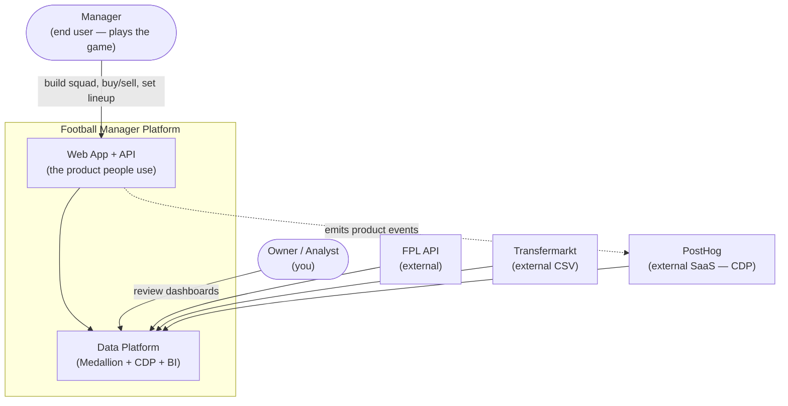
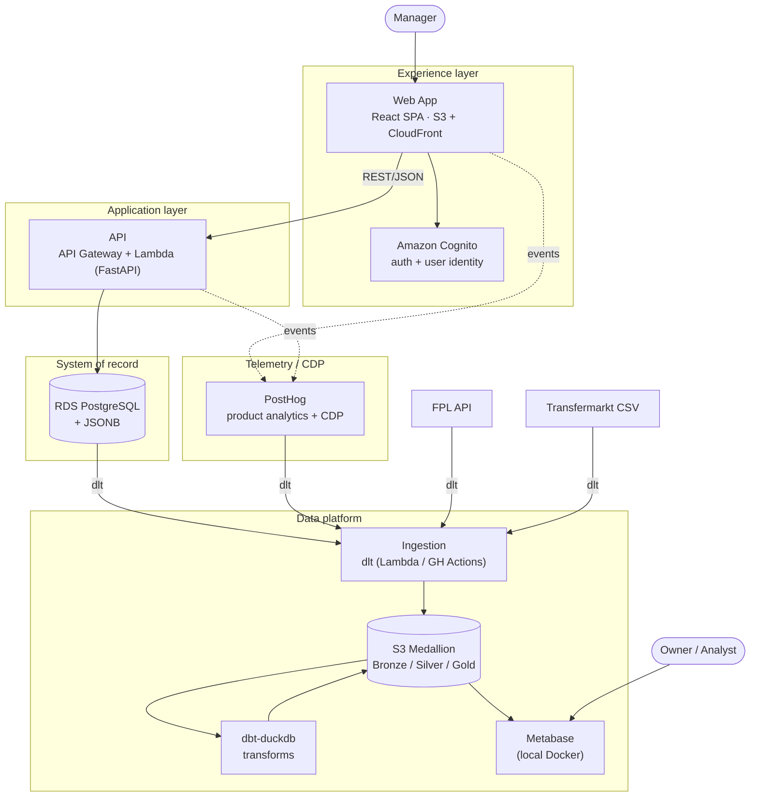
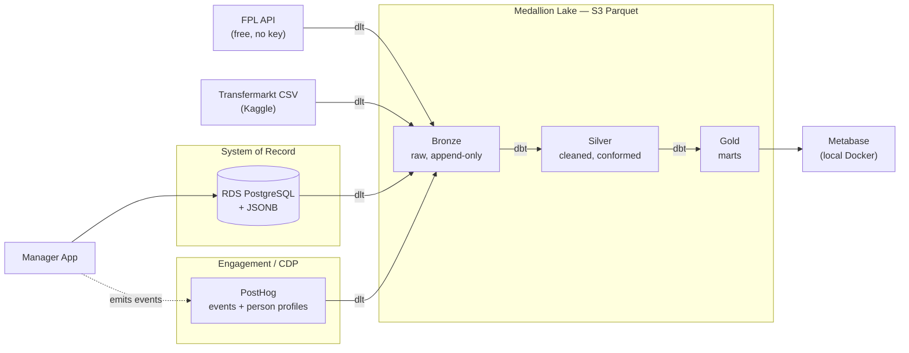
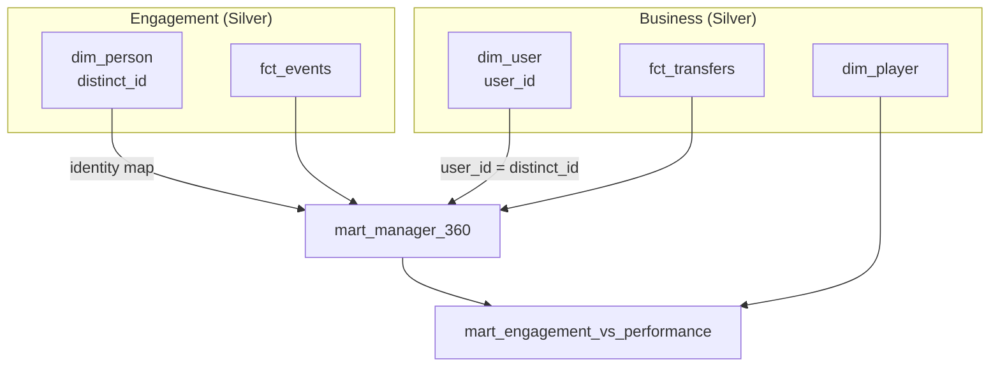
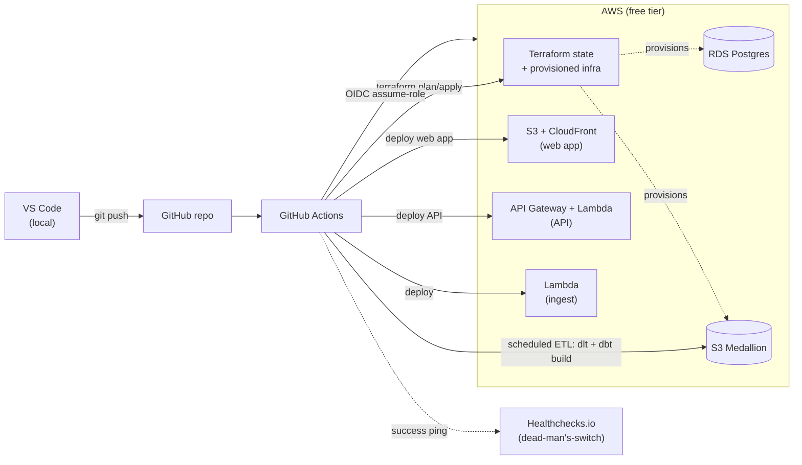

# System Architecture

Planning diagrams for the football-manager platform — the **full product**, from the app people
actually use through to the data platform and BI. Written in **Mermaid** so they render on GitHub,
version-control cleanly, and stay editable as text. Each node maps to an ADR (see
[`../adr/README.md`](../adr/README.md)). Status: planning — reflects intended design, not built state.

The data platform + SLOs are the engineering showcase, but they are *generated by and in service of*
the experience layer (sections 1–2). Sections 3–6 zoom into the data platform.

> Export to PNG/SVG for slides with: `npx @mermaid-js/mermaid-cli -i system-architecture.md -o arch.png`

---

## Method: the C4 model (Simon Brown)

This project treats **architecture as a first-class deliverable — a discipline to practice and
showcase, as important as the code it produces.** The diagrams below follow the **C4 model**, created
by **Simon Brown** (~2011): a set of zoom levels for software, like Google Maps for a system — you
pick the altitude for your audience instead of cramming everything into one diagram.

| Level | Shows | Here |
|---|---|---|
| **1 · Context** | The system as a black box + its users + external systems | §1 ✅ |
| **2 · Container** | Major runnable/deployable units and how they communicate | §2 ✅ |
| **3 · Component** | The building blocks inside a single container | planned — see learning track |
| **4 · Code** | Class/entity-level detail | rarely needed; skip unless it earns its keep |

> ⚠️ In C4, a **"container" is an app, service, or data store — something that *runs*.** It predates
> and is unrelated to Docker.

C4 is **notation-independent** — it's a way of thinking, not a shape standard. We render it in Mermaid
for now. Sections 3–6 are **supplementary views** (data-flow, identity, deployment, layer tables),
which C4 explicitly permits alongside the core levels.

### C4 learning track (deepen as the project grows)

- [x] **L1 Context + L2 Container** for the whole system (this doc).
- [ ] **L3 Component** diagrams once a container is real — start with the **API** (routers → service
  layer → repository) and the **ingestion Lambda** (dlt sources → schema contract → loader).
- [ ] Evaluate **Structurizr** (Brown's diagrams-as-code — model once, render many views) vs
  hand-drawn Mermaid. ADR-worthy once diagrams multiply.
- [ ] Treat **diagram drift like code drift** — keep the model in sync with reality (a retro concern).
- [ ] Reference: [c4model.com](https://c4model.com) · Simon Brown, *Software Architecture for Developers*.

---

## 1. System context (whole project)

Who uses the system, and the external systems it depends on. (C4 Level 1.)

---

## 2. Container view (whole project)

The runtime pieces and how they connect — experience → application → data. (C4 Level 2.) All on the
AWS free tier; PostHog Cloud free; Metabase local.

Cross-cutting (every container): **Terraform** (IaC, ADR-0009), **GitHub Actions + OIDC** (CI/CD,
ADR-0007), **SRE/SLOs** for both the request path and the data path (see
[`../slo/data-platform-slos.md`](../slo/data-platform-slos.md)).

ADRs: 0014 (web app), 0015 (API), 0016 (Cognito auth) — plus the data-platform ADRs 0002–0013.

---

## 3. End-to-end data flow (Medallion + CDP) — data-platform zoom-in

The two domains — **business/OLTP** and **engagement/CDP** — land into the same Medallion lake and
are joined in Gold.

ADRs: 0002 (Postgres), 0003 (lake), 0004 (DuckDB engine), 0005 (dbt), 0006 (PostHog), 0008
(Metabase), 0010 (dlt), 0011 (FPL).

---

## 4. Identity stitching → Gold marts

The headline join: operational identity (`user_id`) ↔ behavioral identity (PostHog `distinct_id`).
This is what makes "do managers who buy in-form players retain longer?" answerable. (ADR-0013)

---

## 5. Deployment & CI/CD (DevOps quartet)

VS Code → GitHub → Actions assumes an AWS role via **OIDC** (no long-lived keys). Terraform owns
infra; the same pipeline deploys the **web app** (S3 sync + CloudFront invalidation) and the **API**
(Lambda), plus the scheduled ETL. Healthchecks.io is the dead-man's-switch.

ADRs: 0007 (orchestration/CI-CD), 0009 (Terraform), 0014–0016 (app stack). SRE backing: see
[`../slo/data-platform-slos.md`](../slo/data-platform-slos.md).

---

## 6. Medallion layer responsibilities

| Layer | Contract | Example tables | dlt/dbt schema policy |
|---|---|---|---|
| **Bronze** | Raw, append-only, source-faithful (JSONB tolerated) | `bronze_fpl_elements`, `bronze_app_transfers`, `bronze_posthog_events` | `evolve` (tolerate new columns) |
| **Silver** | Cleaned, typed, conformed, deduplicated | `dim_player`, `dim_user`, `dim_person`, `fct_transfers`, `fct_events` | `freeze` (schema contract) |
| **Gold** | Business marts, aggregated, BI-ready | `mart_manager_360`, `mart_engagement_vs_performance`, `fct_price_changes` | tested (dbt tests + elementary) |
